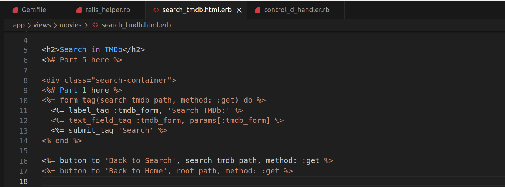
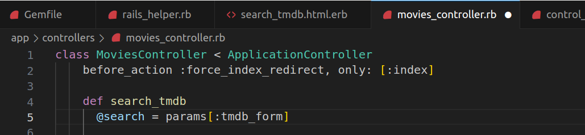

# Examen Final
### Alumna: Zuñiga Chicaña Alejandra Aztirma

# Parte 1

1. Produce un conflicto de fusión (merge) en algún repositorio de tus actividades realizadas. Establece los pasos y comandos que usas para resolver un conflicto de fusión en Git. Si intentas git push y falla con un mensaje como : Non-fast-forward (error): failed to push some refs esto significa que algún archivo contiene un conflicto de fusión entre la versión de tu repositorio y la versión del repositorio origen. Para este ejercicio debes presentar el conflicto dado, los pasos y comandos para resolver el problema y las solución.


2. Digamos que nos dan el modelo de User de la siguiente manera: 

    ``` 
    class User < ActiveRecord::Base
    validates :username, :presence => true
    validate :username_format
    end
    ``` 


    1. **¿Qué pasa si tenemos @user sin nombre de usuario y llamamos a @user.valid? ¿Qué 	guardará @user.save ?**  

    Si se tiene un objeto `@user` sin un nombre de usuario y llamamos a `@user.valid?`, la validación de presencia (`validates :username, :presence => true`) fallará, ya que el nombre de usuario no está presente. Esto significa que `@user.valid?` devolverá `false`. Si intentamos guardar el objeto con `@user.save`, la operación de guardado también fallará, ya que las validaciones no se cumplen.


    2. Implementa username_format. Para los propósitos, un nombre de usuario comienza 	con una letra y tiene como máximo 10 caracteres de largo. Recuerda, las validaciones 	personalizadas agregan un mensaje a la colección de errores.

    ```ruby
    class User < ActiveRecord::Base
    validates :username, :presence => true
    validate :username_format

    private

    def username_format
        unless username.blank? || /\A[A-Za-z][A-Za-z0-9]{0,9}\z/.match?(username)
        errors.add(:username, "debe comenzar con una letra y tener como máximo 10 caracteres de largo.")
        end
    end
    end
    ```

3. Completa el método before_filter:check_admin a continuación que verifica si el campo de administrador en @user es verdadero. De lo contrario, redirija a la página admin_login con un mensaje que indica acceso restringido.

    ```ruby
    class AdminController < ApplicationController
            before_filter :check_admin
            #Completa el codigo
    ```

    Completamos el código de la siguiente manera:

    
    ```ruby
    class AdminController < ApplicationController
    before_filter :check_admin

    private

    def check_admin
        unless @user.admin?
        redirect_to admin_login_path, alert: "Acceso restringido. Debes ser un administrador para ver esta página."
        end
    end
    end
    ```

Este código asume que el modelo `User` tiene un método `admin?` que devuelve `true` si el usuario es un administrador y `false` de lo contrario.

4. A continuación, se te proporciona un formulario que simula el inicio de sesión. Comprueba si la combinación de nombre de usuario y contraseña funciona junto con la cuenta, si la hay. Para hacer eso, queremos que se realice una solicitud HTTP POST cuando se envíe este formulario. Escribe tu solución con jQuery y comenta dónde debe ubicarse la función de devolución de llamada (callback). Comprueba tus resultados.

    ```ruby
    <form method="POST" id="foo">
    <input type="text" class="user" />
    <input type="password" class="pass" />
    <input type="button" value="Log␣in" id="onSubmit" />
    </form>
    $("#onSubmit").click(function() {
    # Tu codigo
    })
    ```

    Completamos el código de la siguiente manera:

    ```html
    <form method="POST" id="foo">
    <input type="text" class="user" />
    <input type="password" class="pass" />
    <input type="button" value="Log in" id="onSubmit" />
    </form>

    <script>
    $("#onSubmit").click(function() {
        var username = $(".user").val();
        var password = $(".pass").val();

        $.post("/login", { username: username, password: password }, function(response) {
        console.log(response);
        });
    });
    </script>
    ```

 5. ¿Cuándo deberías utilizar la metaprogramación basada en eval en lugar de la metaprogramación basada en bloques?.

    * La metaprogramación basada en `eval` debería evitarse siempre que sea posible debido a sus riesgos de seguridad.  
    * La metaprogramación basada en bloques, generalmente es preferible ya que es más segura y menos propensa a errores. `eval` ejecuta código arbitrario, lo que puede llevar a problemas de seguridad si el código proviene de fuentes no confiables.  
    
    Por lo tanto, es aconsejable utilizar la metaprogramación basada en bloques siempre que sea posible, ya que es más segura y fácil de entender. `eval` generalmente se utiliza en casos muy específicos en los que es necesario, pero se debe usar con precaución.

# Parte 2

Usaremos TDD para crear un controlador, que recibe la solicitud del usuario, y un modelo que en realidad llama al servicio TMDb remoto para obtener información sobre la película especificada.

Ejecutamos `bundle install` para configurar todas las dependecnias, además editamos el gemfile para poder usar algunas gemas extras ya que trabajaremos con TMDb Api y Guard.


```
gem 'faraday'  
group :test do
  gem 'rails-controller-testing'
  gem 'guard-rspec'                 
end
```


Volvemos a ejecutar bundle install para instalar las ultimas gemas que hemos añadido a nuestro archivo gemfile


Luego ejecutamos Rails generate rspec:install para asegurarnos de que los archivos que RSpec que necesitamos estén en su lugar. 


Editamos el archivo `spec/rails_helper.rb` para incluir require 'byebug' en la parte superior, de modo que puedas acceder al depurador según sea necesario para que las pruebas funcionen.


Ejecutamos el paquete `exec guard init rspec` para configurar los archivos necesarios para Guard, lo que dará como resultado la creación de un nuevo Guardfile. Agrega ese archivo a tu repositorio.


Configura la base de datos con el comando habitual `rake db:migrate`


Ejecuta el servidor para mostrar que todo este bien.


Al cargar la pagina observamos que no se observa ninguna pelicula, esto es por que nuestra base de datos esta vacia, se comprueba de la misma manera el la consola de rails, para ello intentamos ejecutar Movie.first para verificar si hay películas en la base de datos. Como aún no hemos agregado ninguna película, esto debería devolver "nil".


Para agregar datos iniciales a la base de datos, copiamos el código que nos proporciona la actividad en el archivo db/seeds.rb. Este código agrega películas a la base de datos utilizando el modelo "Movie".


No se pudo crear la base de datos debido a un problema con BigDecimal, pensé que era un problema con las versiones, pero decidi dejar por un momento de lado ese problema y continuar, al realizar los siguientes pasos sobre la vista, al cargar la pagina, ahora si se visualizaba la base de datos, cabe aclarar que no se hizo ninguna corrección, tan solo cargo la base de datos.


## Paso 1: Escribiendo una nueva vista

1.  Llamaremos a la acción del controlador search_tmdb, Lo primero que haremos será crear la vista  rrespondiente a esa acción 

    **Vista `search_tmdb.html.erb` en la carpeta `app/views/movies`:**

    Asegúrate de que tu vista `search_tmdb.html.erb` tenga un formulario con los elementos necesarios. Aquí hay un ejemplo para ayudarte a comenzar:

    ```html
    <!-- app/views/movies/search_tmdb.html.erb -->

    <%= form_tag(search_tmdb_path, method: :get) do %>
        <%= label_tag :tmdb_form, 'Search TMDb:' %>
        <%= text_field_tag :tmdb_form, params[:tmdb_form] %>
        <%= submit_tag 'Search' %>
    <% end %>

    <%= button_to 'Back to Search', search_tmdb_path, method: :get %>
    <%= button_to 'Back to Home', root_path, method: :get %>
    ```


    Copiamos este codigo en nuestro archivo ya mencionado, así como se observa a continuación:

    

    Este formulario envía una solicitud GET a la acción `search_tmdb` del controlador `MoviesController`.

    
    **Controlador `MoviesController` con el método `search_tmdb`:**  
    Ahora, en dicho controlador, debemos tener el método `search_tmdb` que manejará esta solicitud. Se agregara lo siguiente en `app/controllers/movies_controller.rb`:

    ```ruby
    # app/controllers/movies_controller.rb
    class MoviesController < ApplicationController
        def search_tmdb
        # Lógica para realizar la búsqueda en TMDb
        end
    end
    ```

    


    **RSpec Test para el método `search_tmdb` en `movies_controller_spec.rb`:**  
    Ahora, podemos completar nuestro archivo de especificaciones con el código de prueba. A continuación se tiene una sugerencia:

    ```ruby
    # spec/controllers/movies_controller_spec.rb

    require 'rails_helper'

    describe MoviesController do
        describe 'searching TMDb' do
        it 'calls the model method that performs TMDb search' do
            expect(Movie).to receive(:find_in_tmdb).with('Inception')
            get :search_tmdb, params: { tmdb_form: 'Inception' }
        end

        it 'selects the Search Results template for rendering' do
            get :search_tmdb, params: { tmdb_form: 'Inception' }
            expect(response).to render_template('search_tmdb')
        end

        it 'makes the TMDb search results available to that template' do
            fake_results = [double('movie1'), double('movie2')]
            allow(Movie).to receive(:find_in_tmdb).and_return(fake_results)

            get :search_tmdb, params: { tmdb_form: 'Inception' }
            expect(assigns(:search_results)).to eq(fake_results)
        end
        end
    end
    ```


Recuerda ejecutar tus pruebas con `bundle exec rspec` para verificar su validez y avanzar en el proceso de desarrollo. También, ten en cuenta que este código es un punto d